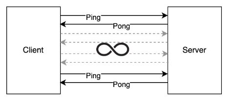

# WebTransport Ping-Pong App

## Description

Create a client-server ping-pong application with the following specs:

Essential Requirements:
- Preferably the Client should be written in RUST, but feel free to use any other language
you are comfortable with or believe is best for this operation.
- The Server should be written in Python
- Communication protocol should be in WebTransport
- Provide some unit test coverage for both sides to demonstrate your skill in unit testing

Desirable Requirements:
- Make the communication channel secure or suggest what security measures you would
implement given more time.
- Provide a plan for Kubernetes deployment
- Provide a plan/design for an auto-recovery mechanism for both sides (in case of a
temporary connection failure). Feel free to implement that if you have enough time.
- Provide integration tests
- Can you think of a way for the client to auto-discover the server without the need to point
it to the exact server endpoint?
